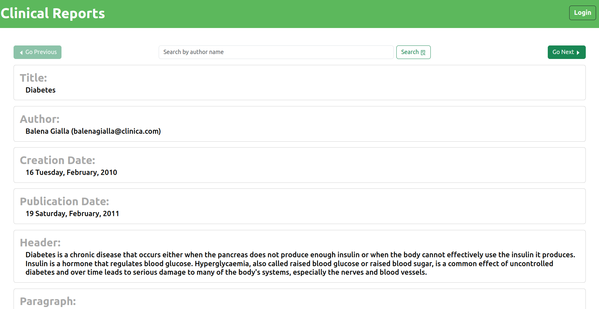
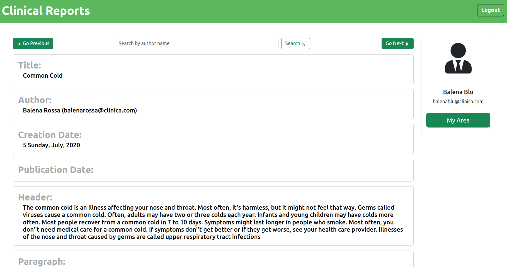
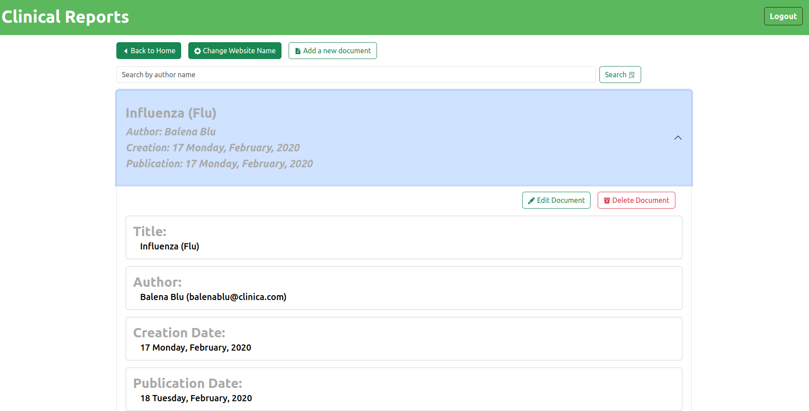
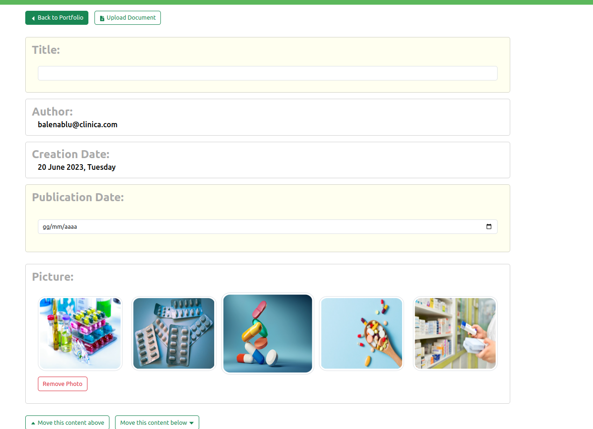

# Clinical Reports

Clinical Reports is a CMS web-based application

## React Client Application Routes

- Route `/`: it prompts to the user the home page.
- Route `/login`: it prompts to the user the login page.
- Route `/new`: it prompts to the user the application editor for a brand-new document.
- Route `/edit/:id`: it prompts the user to use the application editor to make changes to a current document.
- Route `/portfolio`: it prompts the user portfolio.
- Route `/customize`: it prompts the website name editor

## API Server
### Pages APIs

  - GET `/api/sorted-documents/:index`
    - Provided an index, it returns such document as a list of contents (headers, paragraphs, photos) from 
    documents list.

  - GET `/api/users/:name/documents`
    - Provided a name, it returns the list of documents related to such author name
  

  - GET `/api/documents/mine`
    - It returns all your documents
    - **Requires you to be authenticated**

  - GET `/api/documents/:id`
      - It returns the document with that ID

  - DELETE `/api/documents/:id`
    - It deletes the document with that ID
    - **Requires you to be authenticated**
  

  - PUT `/api/documents/:id`
    - Provide a body, it updates the document with that ID
    - **Requires you to be authenticated**

  - POST `/api/documents`
    - Provide a body, it creates a new document
    - **Requires you to be authenticated**

  - GET `/api/admins`
    - Returns the list of admins
    - **Requires you to be authenticated**
    

  - GET `/api/images`
    - Returns the of all available images

  - GET `/api/website-name`
    - It returns the website name

  - PUT `/api/website-name`
    - Provided a name in the body website document name, it edits the website name accordingly
    - **Requires you to be authenticated**

## Database Tables

- Table `USERS`    - contains (ID, EMAIL, NAME, HASH, SALT)
- Table `ADMINS`   - contains (USER ID)
- Table `PAGES`    - contains (ID, TITLE, USER ID, CREATION DATE, PUBLICATION DATE, CONTENT ID)
- Table `CONTENTS` - contains (ID, CONTENT ID, MEDIA-TYPE, PAYLOAD)

## Main React Components

- `Home`    (in `Home.jsx`): it draws the home page and provides the user with horizontal navigation keys between the 
various pages of the platform, a search section. If you are logged in, the component exhibits a login area 
for your portfolio.
- `Portfolio`  (in `Portolfio.jsx`): it provides the authenticated user with a view of their documents, the ability to 
delete, modify or create new ones. If the authenticated user is also an administrator, it allows the search of other 
users' documents, and therefore the application of the previous actions.
- `Editor`  (in `Editor.jsx`): it provides a minimal editor for creating and editing documents.

## Home before authentication

## Home after authentication

## Portfolio

## Editor

## Users Credentials

    USERNAME: balenablu@clinica.com
	PASSWORD: balenablu (admin)

    USERNAME: balenarossa@clinica.com
	PASSWORD: balenarossa (admin)

    USERNAME: balenagialla@clinica.com
	PASSWORD: balenagialla

    USERNAME: balenaverde@clinica.com
	PASSWORD: balenaverde

